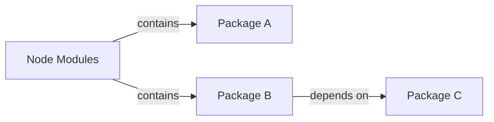
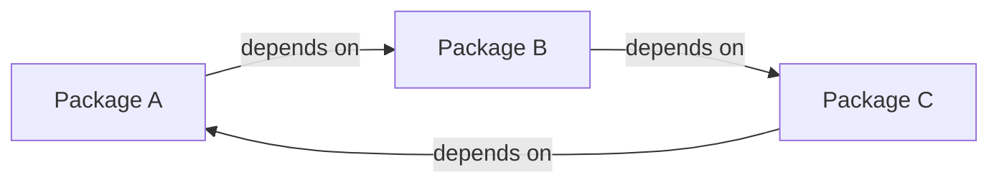
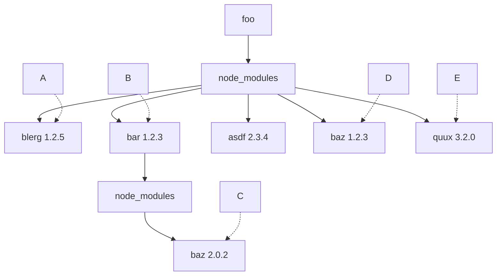
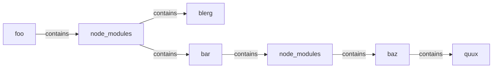

# Understanding npm Package Structure 
--------------------------------------------------------------

As a developer, I recently found myself struggling to fix a broken package in one of my projects. While digging through the npm documentation, I stumbled upon the intricacies of npm's algorithms and folder structures. In this article, we'll dive into the world of npm and explore how it handles package dependencies.

Global Installation
-------------------

Before we dive into the specifics, let's quickly cover what global installation is in npm. When you install a package globally using `npm install -g <package-name>`, it becomes available for all projects on your system. This is useful when you want to share a utility or tool across multiple projects.
bund

Folder Structures
-----------------

Now, let's examine the folder structures that npm creates. By default, npm installs dependencies in a nested manner, with each package having its own `node_modules` directory. However, this can lead to infinite regressions if the same package is installed repeatedly at different levels.

To prevent this, npm introduces the concept of "hoisting" – moving dependencies up to the highest level possible. This is achieved by default in version 3 and above.

Circular Dependencies
-----------------------

But what happens when we have circular dependencies? For example, consider a scenario where `package A` depends on `package B`, which in turn depends on `package C`, which depends on `package A`. This creates an infinite loop that npm must handle.

npm Algorithms
--------------

To resolve these circular dependencies, npm uses a deterministic algorithm. When installing a package, npm checks the dependency graph and installs packages only if necessary. For example, if `package B` has a dependency on `package C`, but `package A` already installed `package C`, then there's no need to install another copy.

Folder Structure
----------------

So, what are the folder[^folder] structures that npm creates? Let's examine a typical scenario where we have multiple packages with dependencies:

In this example, we have:

* `foo` as the top-level package
* `node_modules` directory containing dependencies
* `blerg` and `bar` packages with their own dependencies
* `baz` and `quux` packages installed under `bar`
* Circular dependency between `bar` and `quux`

By understanding npm's algorithms and folder structures, we can better manage our package dependencies and avoid common issues like circular dependencies.

Useful command to view the dependencies tree
-----------------------------------------------

**npm ls**
Here's a paragraph summarizing the usage, usefulness, and benefits of `npm ls`:

`npm ls` is a command-line tool that provides a logical dependency tree structure for all installed packages in your project. This command is particularly useful when working with complex dependencies and managing package versions. 

By using `npm ls`, you can easily visualize the relationships between different packages and identify potential issues or conflicts. The output includes information about each package, including its version, dependencies, and whether it's installed globally or locally. With `npm ls`, developers can quickly diagnose problems, optimize their dependency tree, and ensure that their project is using the correct versions of required libraries.

Some Community repo that helps to improve npm ls 

[HowFat](https://github.com/megahertz/howfat)

**Conclusion**

In this article, we explored the world of npm and its algorithms[^footnote] for handling package dependencies. We saw how global installation works and examined the folder structures that npm creates. By mastering these concepts, you'll be well-equipped to tackle even the most complex package dependencies in your projects. For more information you may want to explore the source code of on npm cli install[^npm-install]

Ref:

[^footnote]: [Algorithms](https://docs.npmjs.com/cli/v10/commands/npm-install#algorithm )
[^folder]:  [Folder](https://docs.npmjs.com/cli/v10/configuring-npm/folders)
[^npm-install]: [NpmCli](https://github.com/npm/cli/blob/latest/lib/commands/install.js)

