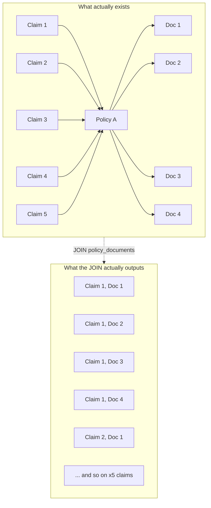
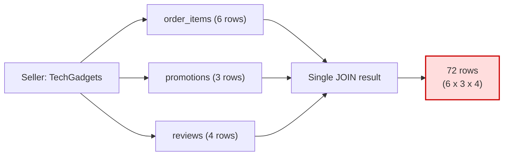
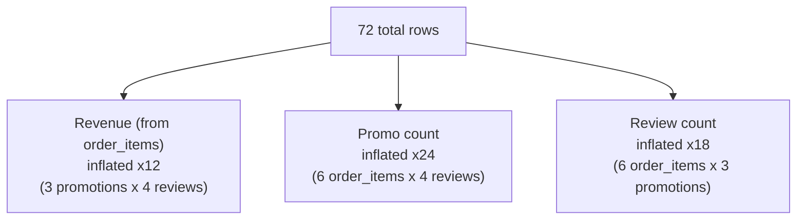
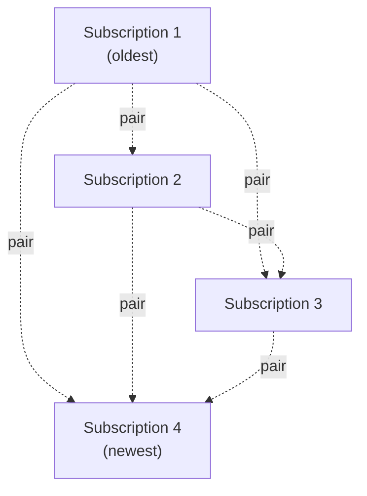
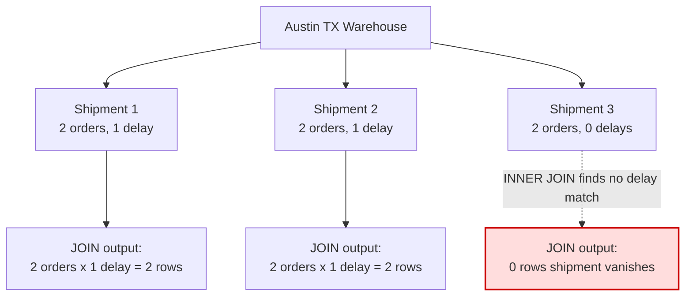
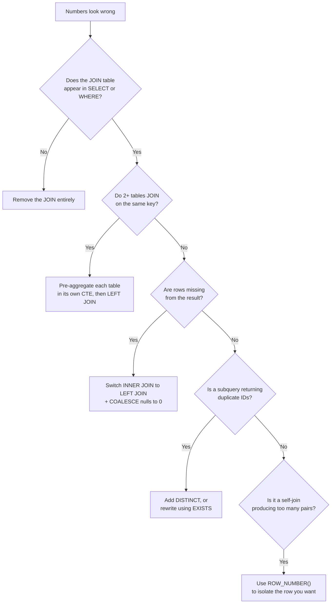

# The Day My Dashboard Lied to Me: A Plain-English Guide to Debugging JOIN Fan-out 

A few weeks ago I got debugging related interview question from popular Opensource BI tools  : "Why does the dashboard say TechGadgets made way more revenue than what's in their bank statement?" My first instinct was to blame the data pipeline. My second instinct slap me back instantly "This is interviewww Winnn" , after 3 mins of staring at a SQL query that looked perfectly reasonable, was to question my own competence.

The query wasn't broken. It was *too good* at its job. It was a JOIN, doing exactly what JOINs do and that's the whole problem. I wish someone had given me that day to "how do I approach it in five minutes the next time it happens."

## The one-sentence version
 
A JOIN doesn't combine two tables  it builds every possible pairing between matching rows. If one side has more than one match, your "single" row turns into several copies of itself. That multiplication is called **fan-out**, and once it happens, every SUM, COUNT, and AVG built on top of it is wrong.
 
## A kitchen-table analogy first
 
Imagine you have a list of 5 students, and a separate list of the classes each student is enrolled in. If you ask "give me one row per student, with their classes attached," and a student is in 3 classes, that student doesn't appear once  they appear 3 times, once per class. Ask for `SUM(student_score)` over that joined table, and you've just tripled that one student's score in the total, because you summed across the duplicated rows.
 
That's it. That's fan-out. Everything else in this article is just that idea showing up in increasingly sneaky disguises.
 
## Example 1  The "obviously fine" JOIN that wasn't
 
Here's the bug exactly as I first met it, simplified. We have an insurance agent, Maria Lopez, with 5 claims. The query also joined in `policies` and `policy_documents`  tables nobody on the team remembered were there, left over from an earlier version of the report.
 
- Each claim has exactly 1 policy.
- Each policy has 4 documents attached.
The report wanted "number of claims," but the join silently expanded the result.
 

 
Here's roughly the query that caused it  looks completely innocent:
 
```sql
-- BUGGY: joins in policy_documents even though nothing
-- from it is ever selected
SELECT
  cl.id AS claim_id,
  cl.status,
  COUNT(*) AS row_count   -- this is what got inflated
FROM claims cl
JOIN policies p ON cl.policy_id = p.id
JOIN policy_documents pd ON p.id = pd.policy_id  -- <- the culprit
WHERE cl.agent_id = 'maria-lopez'
GROUP BY cl.id, cl.status;
```
 
The math behind that diagram is simple multiplication: **5 claims × 1 policy × 4 documents = 20 rows**, where we expected 5. Divide 20 by 5 and you get an **inflation factor of 4x**  meaning `COUNT(*)` and any `SUM()` on claim-level fields are now counting every claim four times over.
 
The fix was almost embarrassing once we saw it: the report never actually needed `policy_documents`. We removed the join entirely and were back to a clean 5 rows. The lesson that stuck with me: **a JOIN that contributes no column to your SELECT or WHERE is pure risk with zero reward  delete it.**
 
## Example 2  When two JOINs gang up on you
 
The TechGadgets bug was nastier because two fan-outs happened *at the same time*, multiplying each other. The seller had:
 
- 6 order_items
- 3 promotions
- 4 reviews
All three were joined directly to the `sellers` table in one query, hoping to compute total revenue, promo usage, and average rating together.
 

 
Here's the part that makes this bug genuinely sneaky: each metric gets corrupted by a *different* multiplier, so nothing about the wrongness looks consistent:
 

 
Here's the query that produced it  three JOINs, one seller, one disaster:
 
```sql
-- BUGGY: order_items, promotions, and reviews all join
-- directly to sellers on the same FK, so they cross-multiply
SELECT
  s.id,
  s.name,
  SUM(oi.price) AS total_revenue,     -- inflated x12
  COUNT(DISTINCT pr.id) AS total_promos,  -- DISTINCT band-aid, still risky
  COUNT(rv.id) AS total_reviews       -- inflated x18
FROM sellers s
JOIN order_items oi ON s.id = oi.seller_id
JOIN promotions pr ON s.id = pr.seller_id
JOIN reviews rv ON s.id = rv.seller_id
WHERE s.id = 'techgadgets'
GROUP BY s.id, s.name;
```
 
Why those specific multipliers? Each `order_items` row gets copied once for every promotion-review combination  3 × 4 = 12 copies  so revenue (which lives on order_items) is inflated 12x. Each promotion row gets copied once for every order_item-review combination  6 × 4 = 24  so the promo count is inflated 24x. Same logic for reviews, inflated 18x. Three numbers, three different wrong answers, all from one innocent-looking query.
 
**The fix:** stop joining raw detail tables side-by-side. Instead, pre-aggregate each one in its own little summary table first (a CTE  think of it as a temporary named result you can reuse), so each fact only gets counted once, *then* join those clean summaries together:
 
```sql
WITH revenue AS (
  SELECT seller_id, SUM(price) AS total_revenue
  FROM order_items
  GROUP BY seller_id
),
promo_count AS (
  SELECT seller_id, COUNT(*) AS total_promos
  FROM promotions
  GROUP BY seller_id
),
review_count AS (
  SELECT seller_id, COUNT(*) AS total_reviews
  FROM reviews
  GROUP BY seller_id
)
SELECT
  s.name,
  COALESCE(revenue.total_revenue, 0) AS total_revenue,
  COALESCE(promo_count.total_promos, 0) AS total_promos,
  COALESCE(review_count.total_reviews, 0) AS total_reviews
FROM sellers s
LEFT JOIN revenue ON s.id = revenue.seller_id
LEFT JOIN promo_count ON s.id = promo_count.seller_id
LEFT JOIN review_count ON s.id = review_count.seller_id;
```
 
One row in, one row out, every number correct. This pattern  aggregate first, join second  is the single most useful habit in this whole article.
 
## Example 3  The self-join that pairs everything with everything
 
This one shows up when you join a table to *itself*, usually to compare a row with a previous or related row. Acme Corp has 4 subscriptions, and we wanted to compare each subscription to the ones that came before it (a common "find the previous record" pattern), using a self-join filtered with `WHERE s2.date > s1.date`.
 
It feels like it should produce a handful of comparisons. It actually produces every valid *pair*:
 

 
Here's the self-join that produced all 6 pairs instead of one "previous subscription" per row:
 
```sql
-- BUGGY: pairs every subscription with every OLDER one,
-- not just its immediate previous one
SELECT
  s1.id AS current_sub,
  s2.id AS previous_sub,
  s1.date AS current_date,
  s2.date AS previous_date
FROM subscriptions s1
JOIN subscriptions s2
  ON s1.customer_id = s2.customer_id
  AND s2.date < s1.date;   -- <- matches ALL earlier rows, not just the nearest one
```
 
Count the dotted lines: 3 + 2 + 1 + 0 = 6 pairs, not the 16 (4×4) you'd get from a careless cross-join, and not 4 either. This shape is called a **triangular number**, and there's a clean formula for it:
 
```
pairs = N x (N - 1) / 2
      = 4 x 3 / 2
      = 6
```
 
If you ever see a self-join's row count and it doesn't match your expectations, check whether it fits this triangle pattern  it's a strong signal you're pairing every row with every *other* row instead of just its immediate neighbor.
 
**The fix** is to stop comparing every pair and instead rank each row, so you can grab exactly the one you wanted (e.g., "the previous subscription"):
 
```sql
SELECT *
FROM (
  SELECT
    s.*,
    ROW_NUMBER() OVER (PARTITION BY customer_id ORDER BY date DESC) AS rn
  FROM subscriptions s
) ranked
WHERE rn <= 2  -- rn = 1 is current, rn = 2 is previous
```
 
`ROW_NUMBER()` just means "number these rows 1, 2, 3... within each group, in this order"  it turns a messy many-to-many pairing problem into a simple filter.
 
## Example 4  When a JOIN deletes rows instead of duplicating them
 
So far every example has been about getting *too many* rows. Now the opposite trap: getting too few, because an `INNER JOIN` quietly throws away anything that doesn't have a match on both sides.
 
The Austin, TX warehouse has 3 shipments. Two shipments each have 2 orders and 1 recorded delay. The third shipment has 2 orders but **zero** recorded delays.
 

 
Here's the query that both inflated two shipments and silently deleted the third:
 
```sql
-- BUGGY: INNER JOIN on delays drops any shipment with
-- zero delays, AND orders+delays fan-out multiplies the rest
SELECT
  sh.id AS shipment_id,
  SUM(o.value) AS total_value,   -- doubled for Ship1 & Ship2
  COUNT(d.id) AS delay_count     -- inflated, and Ship3 missing entirely
FROM shipments sh
JOIN orders o ON sh.id = o.shipment_id
JOIN delays d ON sh.id = d.shipment_id   -- <- INNER JOIN drops Ship3
WHERE sh.warehouse = 'Austin TX'
GROUP BY sh.id;
```
 
Total: 2 + 2 + 0 = **4 rows, not 6**. And this single bug causes three separate, simultaneous problems: Shipment 1 and 2's revenue is double-counted (because of the order × delay fan-out we already know about), and Shipment 3's revenue is **missing entirely**, because `INNER JOIN` requires a match on *both* sides, and a shipment with no delay record has no row to match against.
 
This is the most dangerous fan-out variant precisely because it doesn't look like a bug  your totals just look slightly, plausibly low, and nothing crashes.
 
**The fix** combines two ideas you've already seen: pre-aggregate each table separately, then attach them with `LEFT JOIN` (which keeps a row even when there's no match) instead of `INNER JOIN`, and use `COALESCE` to turn "no match" into a clean `0` instead of a blank:
 
```sql
WITH order_totals AS (
  SELECT shipment_id, COUNT(*) AS order_count
  FROM orders
  GROUP BY shipment_id
),
delay_totals AS (
  SELECT shipment_id, COUNT(*) AS delay_count
  FROM delays
  GROUP BY shipment_id
)
SELECT
  sh.id,
  COALESCE(order_totals.order_count, 0) AS order_count,
  COALESCE(delay_totals.delay_count, 0) AS delay_count
FROM shipments sh
LEFT JOIN order_totals ON sh.id = order_totals.shipment_id
LEFT JOIN delay_totals ON sh.id = delay_totals.shipment_id;
```
 
Now all 3 shipments show up, with delay_count correctly showing 0 for the one that had none.
 
## How to spot fan-out before it spots you
 
After living through all four of these, I started running the same mental checklist every time I write or review a JOIN-heavy query:
 
1. **Do two or more JOINs key off the same foreign key?** (e.g. both `promotions` and `reviews` joined on `seller_id`)  if yes, they will cross-multiply with each other. This is the #1 cause.
2. **Is there a JOIN in the query whose columns never appear in SELECT or WHERE?** If a table is joined in but contributes nothing visible, it's pure fan-out risk for zero benefit  delete it.
3. **Does SUM or COUNT look wrong, but AVG looks fine?** That's a classic tell. If every duplicated row has the same value, AVG stays correct by coincidence while SUM and COUNT silently multiply. Never trust AVG alone  always cross-check with COUNT.
4. **Is there a subquery using `IN (SELECT ... JOIN ...)`?** A JOIN inside that subquery can produce duplicate IDs, and depending on the database engine, the outer query may process the same row more than once. Use `DISTINCT` inside the subquery, or rewrite as `EXISTS`, which doesn't care about duplicates at all.
5. **Is it a self-join with a `WHERE other.date > self.date` style condition?** Check whether the row count matches the triangular formula `N × (N-1) / 2`  if it does, you're pairing everything with everything instead of picking one specific match.

## A 60-second diagnosis recipe
 
When a number looks suspicious and I don't yet know why, I run this exact four-step check before touching any application code:
 
```sql
-- Step 1: how many rows should exist, before any joins?
SELECT COUNT(*) FROM orders;
 
-- Step 2: how many rows exist after adding the join in question?
SELECT COUNT(*) FROM orders o
JOIN promotions p ON o.seller_id = p.seller_id;
 
-- Step 3: divide the two  that's your inflation factor.
-- (result of step 2) / (result of step 1) = how many times each row is duplicated
 
-- Step 4: find exactly which keys are causing it
SELECT seller_id, COUNT(*)
FROM promotions
GROUP BY seller_id
HAVING COUNT(*) > 1;
```
 
That last query is the one that actually tells you *where* the duplication lives  any `seller_id` (or whatever key you're joining on) with a count greater than 1 is a multiplier waiting to happen the moment you join that table to anything else.
 
## The decision tree I now run on Debugging 
 

 
## The universal template I now reach for by default
 
Almost every fix above boils down to the same shape: **aggregate first, join second, never join raw detail tables side by side.**
 
```sql
WITH metric_a AS (
  SELECT fk_id, SUM(value) AS total
  FROM table_a
  GROUP BY fk_id
),
metric_b AS (
  SELECT fk_id, COUNT(*) AS total
  FROM table_b
  GROUP BY fk_id
)
SELECT
  e.name,
  COALESCE(a.total, 0) AS metric_a,
  COALESCE(b.total, 0) AS metric_b
FROM entity e
LEFT JOIN metric_a a ON e.id = a.fk_id
LEFT JOIN metric_b b ON e.id = b.fk_id;
```
 
It's not the most exciting SQL you'll ever write, but it's the pattern that turns "why does revenue keep changing every time I add a join" into "obviously, it's correct, look at the row counts."
 
## Closing thought
 
The thing that finally made fan-out click for me wasn't a textbook definition  it was realizing a JOIN never actually "adds information to a row." It builds a new, wider table out of every combination of matches. Whether that combination is the one you wanted is entirely on you to check, every single time, with nothing more sophisticated than `COUNT(*)` and a calculator. Once that idea sits in your head, these bugs stop being scary and start being a five-minute diagnosis.
 
---
 
## Quick-Reference Cheat Sheet
 
### Formulas to memorize
 
| Situation | Formula |
|---|---|
| Single JOIN | `rows = A x B` (matching rows only) |
| Multiple JOINs on same key | `rows = A x B x C x ...` (all multiply together) |
| Inflation factor | `actual rows ÷ expected rows` |
| Self-join pairing (`s2.x > s1.x`) | `N x (N-1) / 2` (triangular number) |
| Self-join cross (no inequality filter) | `N x N` |
| Per-metric inflation in multi-JOIN | `product of all OTHER joined tables' row counts` |
 
### Tips & Tricks
 
- **Count before you JOIN.** Run `COUNT(*)` on the base table first, then again after each JOIN you add  the jump tells you exactly which JOIN caused inflation.
- **SELECT/WHERE test.** If a joined table contributes zero columns to SELECT or WHERE, delete the JOIN  it's free risk.
- **Aggregate first, join second.** Pre-aggregate each detail table in its own CTE before joining multiple tables to the same parent.
- **LEFT JOIN + COALESCE by default** when joining aggregated CTEs back to a parent entity, so missing matches become `0`, not a dropped row.
- **Don't trust AVG alone.** Cross-check with `COUNT(*)`  AVG can look correct even when rows are duplicated.
- **Spot the triangle.** If a self-join's row count fits `N(N-1)/2`, you're pairing every row with every other row  use `ROW_NUMBER()` instead.
- **Kill duplicate-prone subqueries.** Replace `WHERE id IN (SELECT ... JOIN ...)` with `EXISTS` or add `DISTINCT`.
- **One key, one JOIN.** If you see two+ tables joining on the same foreign key, assume cross-multiplication until proven otherwise.

 ### Pitfalls
- ⚠️ Joining multiple one-to-many tables directly to the same parent (the #1 cause of fan-out).
- ⚠️ Leaving a leftover JOIN in a query after refactoring, with no columns used from it.
- ⚠️ Using `INNER JOIN` when some parent rows may have zero matches  silently deletes those rows.
- ⚠️ Trusting `SUM`/`COUNT` on a query you haven't row-counted independently.
- ⚠️ Self-joins with an inequality filter (`date >`, `id <`) without realizing it creates a triangular blow-up.
- ⚠️ `IN (subquery with JOIN)` returning duplicate IDs and double-processing outer rows.
- ⚠️ Assuming AVG being "correct" means the query is bug-free.
- ⚠️ Fixing fan-out by adding `DISTINCT` to the whole query instead of fixing the JOIN  this hides the bug instead of solving it, and breaks the moment two real rows happen to look alike.


Very Good Discussion link on google forum

https://discuss.google.dev/t/the-problem-of-sql-fanouts/119220