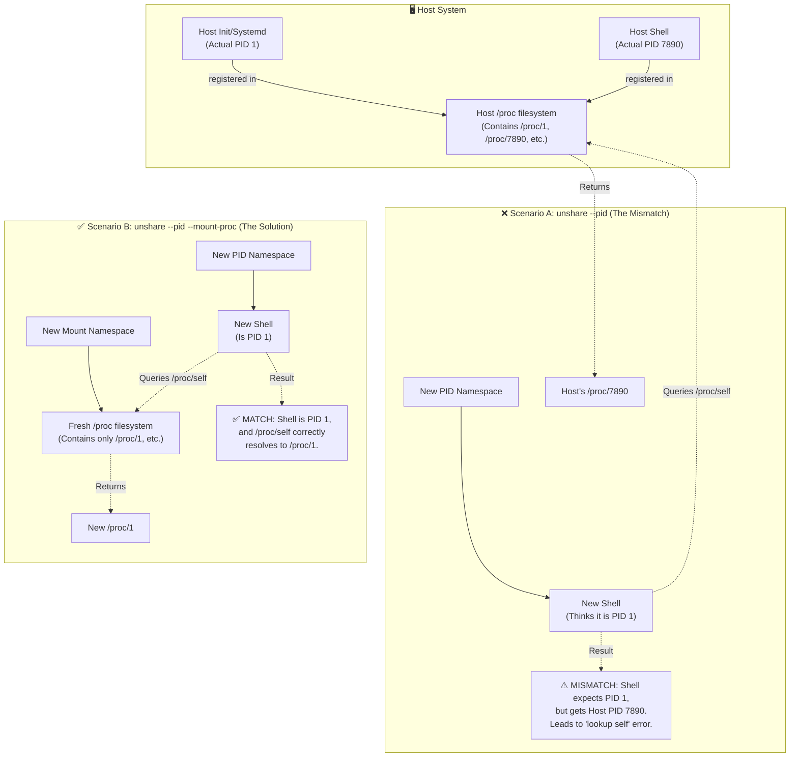

If you are learning how Linux containers work under the hood, you have probably tried to build one from scratch using the `unshare` command. It’s a rite of passage! 

But if you ran this command:
```bash
sudo unshare --fork --pid /bin/bash
```
...and then tried to run a basic command like `ps aux` or `ls -l /proc/self`, you likely crashed headfirst into this cryptic error:

> `fatal library error, lookup self`

At first glance, this looks like a broken . But it’s actually practical demonstration of how Linux namespaces and the `/proc` filesystem interact. Let me go through what is happening under the hood.

---

## 🔍 The Mystery: What is `/proc`?
To understand the error, you first need to understand `/proc`. It is not a real folder on your hard drive. It is a **pseudo-filesystem** generated dynamically in RAM by the Linux kernel. It acts as a real-time window into the kernel's internal data structures, most notably exposing running processes as directories named after their Process IDs (e.g., `/proc/1`, `/proc/7890`).

Crucially, `/proc/self` is a special symlink that always points to the directory of the process that is currently accessing it.

---

## ⚠️ The Problem: The Namespace Mismatch
When you run `unshare --pid`, the kernel creates a brand new PID namespace. Inside this new, isolated world, your new shell becomes **PID 1**. 

However, there is a catch: **the kernel does not automatically change your view of the `/proc` filesystem.** 

Your new shell *believes* it is PID 1. But when it (or a tool like `ps`) asks the `/proc` directory to resolve `/proc/self`, the kernel looks at the *host's* process tree. It sees that your shell's actual host PID is something like `7890`. 

So, `/proc/self` resolves to `/proc/7890`. 

This creates a severe mismatch. The C library expects the process to find its own namespace PID in `/proc`, but instead, it finds the host's PID. The library gets confused, fails to resolve its own identity, and throws the `fatal library error, lookup self`. Worse, it can inadvertently leak information about the host system.

---

## ✅ The Solution: The Magic of `--mount-proc`
To fix this, you must explicitly tell `unshare` to remount the proc filesystem. The correct command is:

```bash
sudo unshare --fork --pid --mount-proc /bin/bash
```

This single flag does two critical things:
1. **Creates a new Mount Namespace:** Giving your new process an isolated view of mounted filesystems.
2. **Mounts a fresh `proc` filesystem:** It executes the equivalent of `mount -t proc proc /proc` *inside* that new mount namespace.

This fresh `/proc` is explicitly tied by the kernel to your **new PID namespace**. Now, when your shell asks for `/proc/self`, it correctly resolves to `/proc/1`. Tools like `ps` work perfectly, and your container is truly isolated.

---

## 🗺️ Visualizing the Interaction



---

## 💡 Key Takeaway
A new PID namespace is practically useless for process management tools unless it is paired with a new Mount namespace and a freshly mounted `proc` filesystem. **Always use `--mount-proc` when isolating PIDs!**

***


Here are the official references for the concepts covered in the article:

1.  **Linux Namespaces Overview**: `man 7 namespaces` – The primary manual page detailing the eight types of Linux namespaces, including PID and Mount namespaces.
2.  **PID Namespaces Specifics**: `man 7 pid_namespaces` – Detailed documentation on how process IDs are isolated and how the `/proc` filesystem interacts with PID namespaces.
3.  **The `unshare` Utility**: `man 1 unshare` – The manual for the command-line tool used to run programs with some namespaces unshared from the parent, including the critical `--mount-proc` flag.
4.  **Proc Filesystem**: `man 5 proc` – Documentation on the pseudo-filesystem that provides an interface to kernel data structures, specifically how it exposes process information via `/proc/[pid]`.

