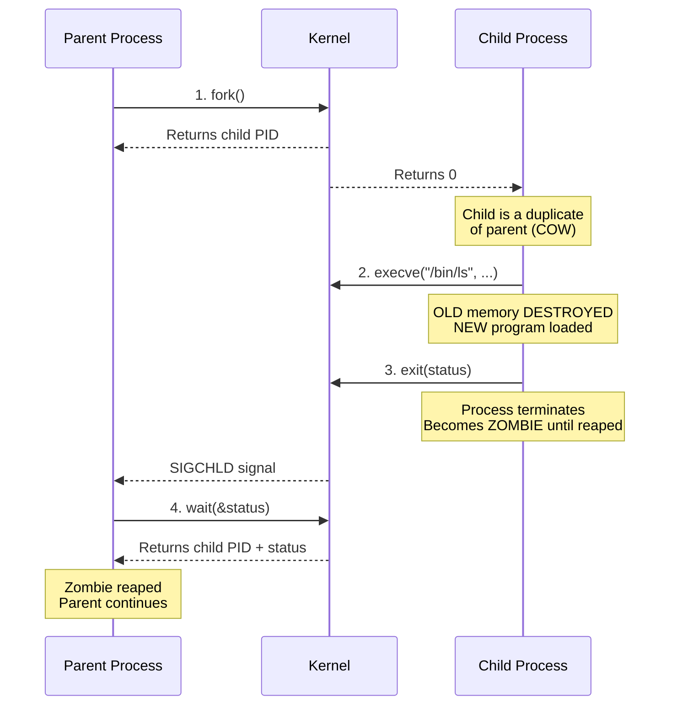
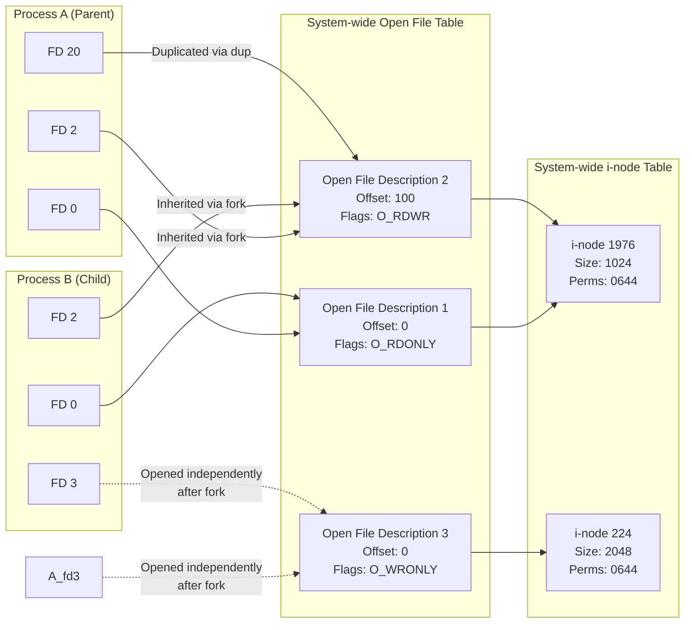
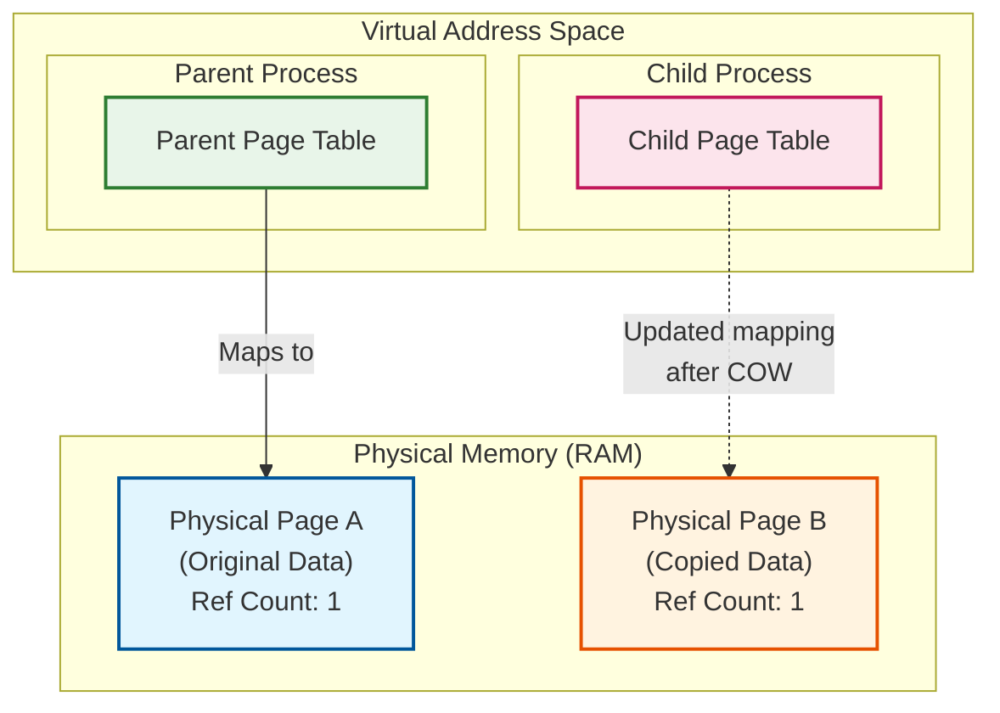
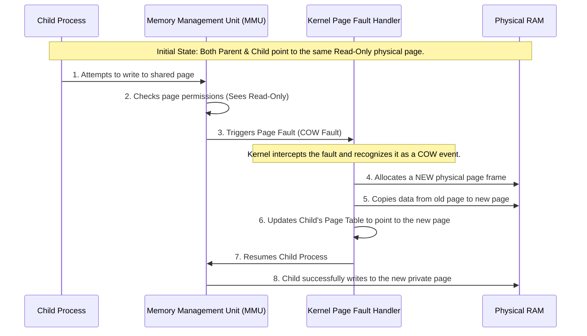

# How Linux Process were created 

## 1. The Big Picture: Overview of `fork()`, `exit()`, `wait()`, and `execve()`

These four system calls are the fundamental building blocks of process creation and management in UNIX/Linux.

*   **`fork()`**: Creates a new child process that is an almost exact duplicate of the parent process.
*   **`execve()`**: Replaces the current process's memory (text, data, stack, heap) with a completely new program.  
<!-- *(This answers your Question 1: `execve` completely destroys the old memory segments created by `fork` and replaces them with the new program's segments).* -->
*   **`exit()`**: Terminates a process and releases all its resources, returning an exit status to the parent.
*   **`wait()`**: Pauses the parent process until one of its children terminates, allowing the parent to collect the child's exit status and prevent "zombie" processes.

### 🔄 Process Lifecycle Sequence Diagram



***

## 2. `fork()` and File Descriptors

When `fork()` is called, the child process inherits **copies** of the parent's file descriptors. 
*Crucial Concept:* These descriptors do not point to separate files; they point to the **same underlying "Open File Description"** in the kernel.

### 🔑 Analogy: The Shared Safe
Imagine a bank safe (the **Open File Description**). 
The parent has a key (File Descriptor 3). When `fork()` happens, the bank makes an exact copy of the key and gives it to the child (Child's File Descriptor 3). 
Both keys open the **exact same safe**, and more importantly, they share the **same internal pointer** (the file offset). If the parent reads 10 bytes, the internal pointer moves 10 bytes forward. When the child uses its key to read next, it will start from the 11th byte.

### 📊 ASCII Diagram: File Descriptor Inheritance



***

## 3. `fork()` and Memory Semantics (Copy-on-Write)

Historically, `fork()` duplicated the parent's entire memory space for the child. This was incredibly slow and wasted RAM. Modern Linux uses **Copy-on-Write (COW)**.

### 📖 Analogy: The Shared Textbook
Imagine the parent and child are given a textbook (the memory pages). 
Instead of printing two expensive books, the library gives them **one shared book**, but locks it in a glass case marked **"Read-Only"**. 
* If both just read it, no extra cost is incurred. 
* If the child wants to take notes (write to memory), the glass case breaks (a **Page Fault** occurs). The librarian quickly photocopies *only that specific page* and gives the copy to the child to write on. 
* This is **Copy-on-Write**: Memory is only physically copied when a process actually tries to modify it.

### 1. Copy-on-Write (COW) Structural Illustration: Memory Mapping After a Write

This flowchart illustrates the state of the virtual and physical memory **after** the child process has attempted to write to a shared page, triggering the Copy-on-Write mechanism.



***

### 2. Detailed Step-by-Step Explanation

To truly understand Copy-on-Write (COW), we have to look at the interaction between the Process, the hardware Memory Management Unit (MMU), and the Kernel. Here is the exact sequence of events:

1. **The `fork()` Call:** When a process calls `fork()`, the kernel creates a new Page Table for the child. **Crucially, it does not copy the physical memory pages.** Instead, it points both the Parent's and Child's page tables to the *exact same* physical page frames in RAM. These shared physical pages are temporarily marked as **Read-Only** (or Copy-on-Write) by the kernel.
2. **The Write Attempt (The Trigger):** Both processes can read from these shared pages without any issues. However, the moment the Child process attempts to **modify (write to)** one of these shared pages, the hardware MMU detects the violation (since the page is marked Read-Only) and halts the process, triggering a **Page Fault**.
3. **Kernel Intervention (The Copy):** The Kernel's page fault handler intercepts this fault. It recognizes it as a COW fault. The kernel allocates a **new, empty physical page frame** in RAM, copies the exact contents of the original shared page into this new page, and marks the new page as Read-Write.
4. **Page Table Update:** The kernel updates the **Child's** page table to point to the newly copied physical page. The Parent's page table is left untouched and continues to point to the original physical page.
5. **Resumption:** The kernel resumes the Child process. The Child's write operation now succeeds because it is writing to its own private, Read-Write physical page.

**The Result:** Both processes now have their own independent copies of the modified data. However, any pages that were *never modified* remain shared in physical RAM, saving massive amounts of memory.

***

### 3.  The COW Mechanism in Action with sequence Diagram

This sequence diagram visualizes the exact chronological flow of the Page Fault and the Kernel's Copy-on-Write intervention described above.




### Summary of the "Magic" of COW
* **Before `fork()`**: 1 set of physical pages.
* **Immediately after `fork()`**: Still 1 set of physical pages (shared, marked Read-Only).
* **After a write**: 2 sets of physical pages (only the specific pages that were written to are duplicated).

This mechanism is why `fork()` is incredibly fast and memory-efficient, even for massive processes like web browsers or databases. The kernel only pays the "cost" of copying memory if the child process actually decides to modify it!
```
*Note: The **Text Segment** (program code) is almost always shared and remains Read-Only, as programs rarely modify their own executable code.*
```
***

## 4. The Magic of `fork()` + `execve()`

Why do we usually call `fork()` immediately followed by `execve()`? 
Because of **Copy-on-Write**, if the child calls `execve()` immediately, the new program destroys the old memory segments (text, data, stack, heap) and replaces them with the new program's segments. 
*Result:* The kernel **never actually had to physically copy the memory pages** because the child never wrote to them! This makes the `fork()` + `execve()` combination incredibly fast and memory-efficient.

***

## 5. Example Code: Putting it all together

Here is a complete C program demonstrating `fork()`, `execve()`, and `wait()`.

```c
#include <stdio.h>
#include <stdlib.h>
#include <unistd.h>
#include <sys/wait.h>

int main(int argc, char *argv[]) {
    pid_t child_pid;
    int status;

    printf("Parent: My PID is %d\n", getpid());

    // 1. Create a child process
    child_pid = fork();

    if (child_pid == -1) {
        perror("fork failed");
        exit(EXIT_FAILURE);
    }

    if (child_pid == 0) {
        // --- CHILD PROCESS ---
        printf("Child: My PID is %d. I am about to execve()!\n", getpid());
        
        // Prepare arguments for execve
        // execve requires: path to program, array of arguments, array of environment vars
        char *args[] = {"/bin/ls", "-l", NULL};
        char *env[] = {NULL}; // Inherit environment or pass NULL
        
        // 2. Replace child's memory with the '/bin/ls' program
        // This destroys the child's original text, data, stack, and heap!
        execve("/bin/ls", args, env);
        
        // If execve returns, it MUST have failed.
        perror("execve failed");
        exit(EXIT_FAILURE);
    } else {
        // --- PARENT PROCESS ---
        printf("Parent: Forked child with PID %d. Waiting for child to finish...\n", child_pid);
        
        // 4. Wait for the child to terminate and collect its exit status
        wait(&status);
        
        if (WIFEXITED(status)) {
            printf("Parent: Child exited normally with status %d\n", WEXITSTATUS(status));
        } else {
            printf("Parent: Child exited abnormally.\n");
        }
    }

    return 0;
}
```

### Compile and run:
```bash
gcc -o fork_exec_demo fork_exec_demo.c
./fork_exec_demo
```
You will see the `ls` commands output generated along with process informations. Lets see how it could be breaking down using `strace`.


This `strace` log is a fantastic real-world demonstration of how the C standard library (glibc) maps standard C functions to underlying Linux system calls, and how the process hierarchy and signals operate in practice. 

```bash
strace -f -e trace=process sh -c './fork_exec_demo'
```

Here is a detailed breakdown of your `strace` log. mapping it to the concepts from *The Linux Programming Interface* (TLPI).

### 1. The Process Tree
First, let's identify the three processes involved in this trace based on their PIDs:
*   **PID 21848 (`sh`)**: The outermost shell process executing `sh -c './fork_exec_demo'`.
*   **PID 21849 (`./fork_exec_demo`)**: Your compiled C program.
*   **PID 21850 (`/bin/ls`)**: The grandchild process executed by your C program.

***

### 2. Step-by-Step Log Breakdown

#### Phase 1: Shell starts your program
```text
execve("/usr/bin/sh", ["sh", "-c", "./fork_exec_demo"], ...) = 0
vfork(strace: Process 21849 attached
 <unfinished ...>
[pid 21849] execve("./fork_exec_demo", ["./fork_exec_demo"], ...) <unfinished ...>
[pid 21848] <... vfork resumed>)        = 21849
[pid 21849] <... execve resumed>)       = 0
```
*   **`execve`**: The shell starts.
*   **`vfork`**: Notice that `sh` uses `vfork()` instead of `fork()` to launch your program. This is a common optimization in shells. Because the shell knows the child will immediately call `execve()` to replace itself, `vfork()` avoids copying the parent's page tables, saving time and memory. The parent (`sh`) is blocked until the child calls `execve` or `exit`.
*   **`execve`**: PID 21849 loads and executes `./fork_exec_demo`.

#### Phase 2: Your program forks a child
```text
[pid 21848] wait4(-1, Parent: My PID is 21849
 <unfinished ...>
[pid 21850] clone(child_stack=NULL, flags=CLONE_CHILD_CLEARTID|CLONE_CHILD_SETTID|SIGCHLD, child_tidptr=0x7728dd60da10) = 21850
Child: My PID is 21850. I am about to execve()!
Parent: Forked child with PID 21850. Waiting for child to finish...
```
*   **`wait4`**: PID 21848 (`sh`) is now blocked in `wait4()` (the underlying syscall for the C `wait()` function), waiting for PID 21849 to finish. *(Note: strace interleaves the stdout printfs with the syscalls, which is why you see "Parent: My PID..." mixed with the `wait4` call).*
*   **`clone`**: Your program (PID 21849) calls the C library `fork()`. Under the hood, glibc implements `fork()` using the `clone()` system call. The flags `CLONE_CHILD_CLEARTID|CLONE_CHILD_SETTID|SIGCHLD` are standard glibc flags to ensure proper thread/process cleanup and signal delivery. It creates PID 21850.
*   **Printfs**: The child and parent print their respective messages.

#### Phase 3: The Grandchild executes and exits
```text
[pid 21850] execve("/bin/ls", ["/bin/ls", "-l"], ...) <unfinished ...>
[pid 21849] wait4(-1,  <unfinished ...>
[pid 21850] <... execve resumed>)       = 0
total 112
-rwxrwxr-x 1 ubuntu ubuntu 26736 Jun 20 19:10 a.out
... (ls output omitted for brevity) ...
[pid 21850] exit_group(0)               = ?
[pid 21850] +++ exited with 0 +++
```
*   **`execve`**: PID 21850 replaces itself with `/bin/ls -l`.
*   **`wait4`**: PID 21849 (your program) is now blocked in `wait4()`, waiting for PID 21850 (`ls`) to finish.
*   **`ls` output**: The directory listing is printed to stdout.
*   **`exit_group(0)`**: PID 21850 finishes and exits with status `0`. (`exit_group` is the modern Linux syscall that terminates all threads in a process group, which is what glibc's `exit()` calls).

#### Phase 4: Signals and Parent Cleanup
```text
[pid 21849] <... wait4 resumed>[{WIFEXITED(s) && WEXITSTATUS(s) == 0}], 0, NULL) = 21850
[pid 21849] --- SIGCHLD {si_signo=SIGCHLD, si_code=CLD_EXITED, si_pid=21850, si_uid=1000, si_status=0, si_utime=0, si_stime=0} ---
Parent: Child exited normally with status 0
[pid 21849] exit_group(0)               = ?
[pid 21849] +++ exited with 0 +++
```
*   **`wait4` resumes**: PID 21849's `wait4` unblocks because the child exited. It returns the child's PID (21850) and populates the status integer.
*   **`SIGCHLD`**: The kernel delivers a `SIGCHLD` signal to PID 21849. Because your C program didn't install a custom handler for `SIGCHLD`, the default action (ignore) applies, but the signal is still delivered and recorded by `strace`.
*   **`exit_group(0)`**: Your program prints its final message and exits normally.

#### Phase 5: Shell Cleanup
```text
<... wait4 resumed>[{WIFEXITED(s) && WEXITSTATUS(s) == 0}], 0, NULL) = 21849
--- SIGCHLD {si_signo=SIGCHLD, si_code=CLD_EXITED, si_pid=21849, si_uid=1000, si_status=0, si_utime=0, si_stime=0} ---
wait4(-1, 0x7ffce0a5206c, WNOHANG, NULL) = -1 ECHILD (No child processes)
exit_group(0)                           = ?
+++ exited with 0 +++
```
*   **`wait4` resumes**: The outer `sh` (PID 21848) unblocks, seeing that PID 21849 exited.
*   **`SIGCHLD`**: `sh` receives `SIGCHLD` for your program.
*   **`wait4(..., WNOHANG) = -1 ECHILD`**: Shells often have internal loops to reap any remaining zombie children. Here, `sh` does a non-blocking `wait4` (`WNOHANG`). Because all children have already been reaped, it returns `-1` with `ECHILD` (No child processes).
*   **`exit_group(0)`**: `sh` exits, and the trace ends.

***

### 3. Key TLPI Takeaways from this Trace

1.  **glibc `fork()` vs Linux `clone()`**: In TLPI, you learn that `fork()` is a standard C library function. This trace proves that on Linux, glibc implements `fork()` by invoking the `clone()` system call with specific flags (`SIGCHLD`, `CLONE_CHILD_SETTID`, etc.) to mimic standard POSIX `fork()` semantics.
2.  **`vfork()` Optimization**: The trace shows `sh` using `vfork()`. As TLPI explains, `vfork()` suspends the parent until the child calls `execve` or `_exit`. This is a massive performance optimization because it avoids duplicating the parent's page tables.
3.  **`wait()` vs `wait4()`**: Similarly, the C standard library `wait()` is implemented using the Linux-specific `wait4()` system call under the hood.
4.  **Signal Delivery (`SIGCHLD`)**: The trace explicitly shows the `SIGCHLD` signal being delivered to the parent processes exactly when their children call `exit_group()`. This perfectly illustrates the asynchronous nature of signals and process termination described in TLPI.

***


## References & Books That I used to write this article  


**The Linux Programming Interface** by Michael Kerrisk (Chapter 6,24.1,24.2.1)


Cheers 


